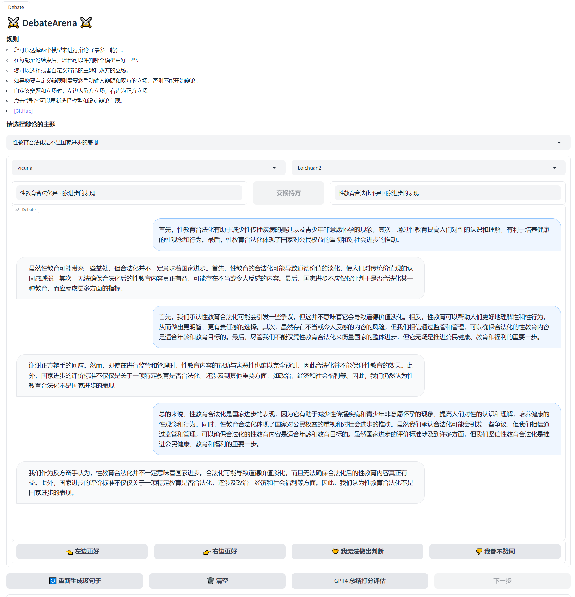
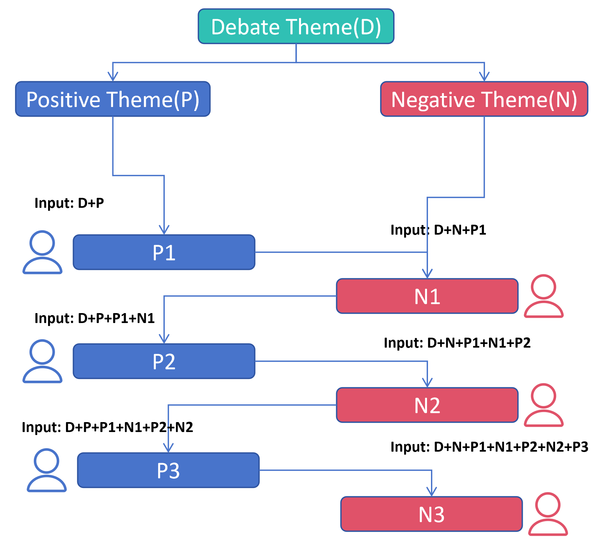

# DebateArena: Multi-Agent Debate Environment for LLMs

<div align="center">

 [Overview](https://github.com/HITsz-TMG/DebateArena#overview) | [Getting Started](https://github.com/HITsz-TMG/DebateArena#getting-started) | [Architecture](https://github.com/HITsz-TMG/DebateArena#architecture) | [Contact](https://github.com/HITsz-TMG/DebateArena#contact)

</div>


## Overview

This repository contains a framework for the large language model debate and a method for deploying local large language models which can provide streaming response.


## Simple Demo


## Getting Started


### Installation
Requirements:

- Python >= 3. 8
- OpenAI API key (optional, for using GPT-3.5-turbo or GPT-4 as an LLM agent)

Install with pip:
```bash
pip install -r requirements.txt
```


### Git Clone the Repository
To launch the demo on your local machine, you first pip install requirements, then git clone this repository to your local folder.
```bash
git clone https://github.com/HITsz-TMG/DebateArena.git
```
### (Optional) Deployling local large language models
To get model response, you need model APIs. There are two classes of APIs. One is public API, the other is deployling local large language models. If you want to deploy local services, you need enough computing power. Currently we support 4 models(vicuna, baichuan2, llama2 and openchat). The services is based on flask.
```bash
python app_vicuna.py
python app_baichuan2.py
python app_llama2.py
python app_openchat.py
```
If you want to use GPT-3.5-turbo or GPT-4 as an LLM agent, you can add OPENAI_API_KEY in gradio_web_server_1.py.
```
import os
os.environ['OPENAI_API_KEY'] = 'YOUR OPENAI_API_KEY'
```
### Launch the Demo
The demo is based on gradio.
```bash
python gradio_web_server_1.py
```

## Architecture


## Contact
If you have any question, please feel free to contact me by e-mail: 22S051013@stu.hit.edu.com or submit your issue in the repository.

<!-- ## Citation
```
@article{shi2023generative,
  title={Generative Multimodal Entity Linking},
  author={Shi, Senbao and Xu, Zhenran and Hu, Baotian and Zhang, Min},
  journal={arXiv preprint arXiv:2306.12725},
  year={2023}
}
```

## License
This repository respects to Apache license 2.0. -->
